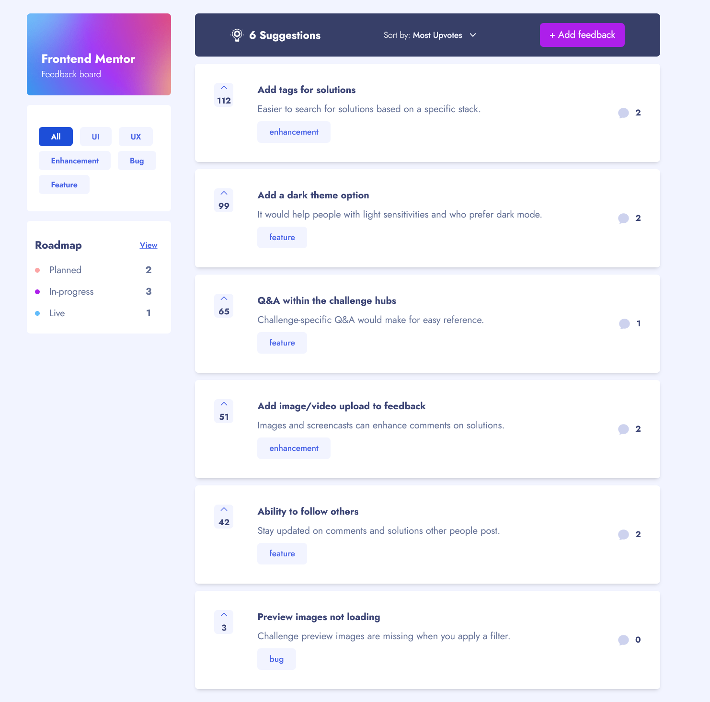

# Frontend Mentor - Product feedback app solution

This is a solution to the [Product feedback app challenge on Frontend Mentor](https://www.frontendmentor.io/challenges/product-feedback-app-wbvUYqjR6). Frontend Mentor challenges help you improve your coding skills by building realistic projects.

## Table of contents

- [Challenge-name] FeedBack App
- [Link] https://delightful-brigadeiros-d50276.netlify.app/
- [Built-with] Built with Next.JS TypeScript and TailwindCSS
- [Author] Eddy Agossou

### Screenshot

### Links

- Solution URL: [Add solution URL here](https://your-solution-url.com)
- Live Site URL: [Add live site URL here](https://your-live-site-url.com)

### Built with

- Semantic HTML5 markup
- CSS custom properties
- Flexbox
- CSS Grid
- Mobile-first workflow
- [React](https://reactjs.org/) - JS library
- [Next.js](https://nextjs.org/) - React framework
- [TailwindCSS](https://styled-components.com/) - For styles

## Author

- Frontend Mentor - (https://www.frontendmentor.io/profile/Maestro2496)
- Twitter - (https://twitter.com/EddyAgossou)
